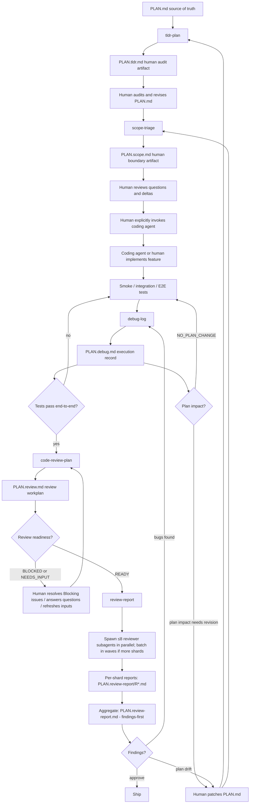

# Plan Audit, Boundary, Debug, Review Brief & Review Report Skills

Cooperative skills that turn a raw implementation plan into something safe to hand to a coding agent, record what actually happens once implementation begins, brief a parallel reviewer fleet once end-to-end tests pass, and run that fleet to produce a decision-ready findings report.

The skills do **not** replace human review. They produce artifacts a human iterates on:

- `tldr-plan` produces a compact human-audit surface for the plan and surfaces traceability gaps.
- `scope-triage` classifies plan items into implementation-scope buckets and surfaces where its classification disagrees with the plan's declared scope.
- `debug-log` records execution reality during smoke / integration / E2E debugging as an append-only, plan-linked bug log.
- `code-review-plan` turns the four artifacts above plus the code diff into a parallelizable code-review workplan: bounded review shards, controlled review angles, adversarial prompts, subagent assignments, and an aggregation contract.
- `review-report` spawns parallel reviewer subagents from the code-review brief (≤8 in parallel, batching in waves), collects their structured shard reports into sidecar files, and aggregates them into a findings-first review report.

Coding-agent handoff happens **only after** a human reviews the scope artifact and explicitly invokes the agent. `tldr-plan` / `scope-triage` / `code-review-plan` never auto-fire anything; `debug-log` never silently edits the source plan; `review-report` never edits source artifacts and never auto-creates `BUG-*` IDs (only suggests them). The human reads the final review report and decides ship / no-ship / iterate.

`debug-log` can be used after agent-driven implementation, manual fixes, or any smoke / integration / E2E debugging event — not only post-agent. `code-review-plan` is invoked after end-to-end tests pass; tests-passing evidence can come from `debug-log` `Current status: PASSING` or from a CI-summary note in the invocation. `review-report` is single-pass: it spawns reviewer subagents and writes the report, or stops before writing any output with a clear reason — no manual fanout fallback, no prompt-export mode, no override flags.

## Pipeline

Tests-passing evidence for `code-review-plan` can come from any of three sources (in priority order): `debug-log` header `Current status: PASSING`, an invocation note with CI / test output, or a user assertion in the invocation note. The diagram's "Tests pass end-to-end?" gate is satisfied by any of them.

`review-report` is single-pass: if subagent spawning is unavailable in the current runtime, it stops before writing any output — no manual fallback. The user sees a single chat error reason.

## When to use which

| Question | Skill |
|---|---|
| Do I need a compact human audit surface for context / assumptions / AC / D0-D6 / evidence, with traceability gaps surfaced? | `tldr-plan` |
| Of the items in the plan, which are MVP / forbidden / deferred / overengineering? | `scope-triage` |
| Did smoke / integration / E2E tests fail (whether agent-driven or manual) and do I need a per-bug execution record? | `debug-log` |
| Did implementation finish, do smoke / integration / E2E tests pass end-to-end, and do I now need to brief a parallel review fleet (humans or AI subagents) on what to review and how to report? | `code-review-plan` |
| Did `code-review-plan` produce a brief and do I now want to actually run the parallel review and get a decision-ready findings report? | `review-report` |
| Do I need the full current flow? | Run `tldr-plan` → `scope-triage` → implement → `debug-log` (until E2E passes) → `code-review-plan` → `review-report`. |

## Cross-skill invariants

- **Source plan is authoritative.** Pipeline skills read `PLAN.md` as ground truth. Derived artifacts never override the plan. `debug-log` may emit `Plan Revision Suggestions` but never silently edits `PLAN.md`. `code-review-plan` may surface plan drift via subagent reports but never edits `PLAN.md`. `review-report` reports findings and routing recommendations only — never edits any source artifact.
- **Human-iterated.** All artifacts are designed for human review. If review surfaces issues, the user revises `PLAN.md` and re-runs the relevant skill.
- **No auto-handoff.** Coding-agent handoff is a deliberate human action, never a triggered side effect of writing an artifact. `code-review-plan` produces a brief; the human launches the reviewer fleet via `review-report`. `review-report` produces a findings report; the human reads §0 Decision Summary and decides ship / no-ship / iterate.
- **Cooperative, not duplicative.** `tldr-plan` audits traceability (AC ↔ D ↔ E grid). `scope-triage` classifies boundary (forbidden / MVP / deferred / overengineering). `debug-log` records execution reality (symptom → root cause → fix → verification → plan impact). `code-review-plan` briefs the reviewer fleet (shards / angles / adversarial prompts / report contract / aggregation contract). `review-report` runs the fleet and aggregates findings (sidecar reports + findings-first final report). None does another's job; in particular, `code-review-plan` does NOT review code itself, and `review-report`'s main agent does NOT review code (only the subagents do, and they're read-only).
- **Different update models on purpose.** Three of five skills (`tldr-plan` / `scope-triage` / `code-review-plan`) regenerate from scratch on every run (pure projections of source + sibling artifacts). `debug-log` is **append-only** — it reads its prior output and updates entries by stable `BUG-*` / `REV-*` / `RUN-*` IDs. `review-report` is **single-pass with overwrite semantics** — final report regenerated from scratch; per-shard sidecar files overwritten per-shard on rerun.
- **First subagent-spawning skill: `review-report`.** Four siblings produce single-document artifacts directly. Only `review-report` spawns reviewer subagents (≤8 in parallel, batching in waves). Cap is conservative (default 5 per batch); prefer fewer focused reviewers over a packed wave. If a review round legitimately needs >8 shards, batches in waves — no flag to override.

## Quick links

- [`tldr-plan/SKILL.md`](tldr-plan/SKILL.md) — entry doc + `## When not to use`
- [`scope-triage/SKILL.md`](scope-triage/SKILL.md) — entry doc + `## When not to use`
- [`debug-log/SKILL.md`](debug-log/SKILL.md) — entry doc + `## When not to use`
- [`code-review-plan/SKILL.md`](code-review-plan/SKILL.md) — entry doc + `## When not to use`
- [`review-report/SKILL.md`](review-report/SKILL.md) — entry doc + `## When not to use`

## Examples

- Small example (scope-triage on a single-feature plan):
  - [`scope-triage/examples/input-plan.md`](scope-triage/examples/input-plan.md)
  - [`scope-triage/examples/output-scope.md`](scope-triage/examples/output-scope.md)
- Smoke-debug example (debug-log on a router zero-active-suspend session):
  - [`debug-log/examples/input-session-notes.md`](debug-log/examples/input-session-notes.md)
  - [`debug-log/examples/output-debug-log.md`](debug-log/examples/output-debug-log.md)
- Code-review-plan example (continues the router zero-active-suspend story; same C20 / BUG-001 anchors):
  - [`code-review-plan/examples/input-artifact-index.md`](code-review-plan/examples/input-artifact-index.md)
  - [`code-review-plan/examples/output-review-plan.md`](code-review-plan/examples/output-review-plan.md)
- Review-report example (continues the router zero-active-suspend story; aggregates 2 returned + 1 missing shard report into a `BLOCKED` final recommendation):
  - [`review-report/examples/input-review-plan.md`](review-report/examples/input-review-plan.md)
  - [`review-report/examples/input-shard-report-r01.md`](review-report/examples/input-shard-report-r01.md)
  - [`review-report/examples/input-shard-report-r02.md`](review-report/examples/input-shard-report-r02.md)
  - [`review-report/examples/output-review-report.md`](review-report/examples/output-review-report.md)
- Multi-milestone walk-through (tldr-plan → scope-triage on a complex plan): TODO. The repo's `plans/miles-port-unified-plan.{md,tldr.md,scope.md}` triple is currently the closest real-world reference.
