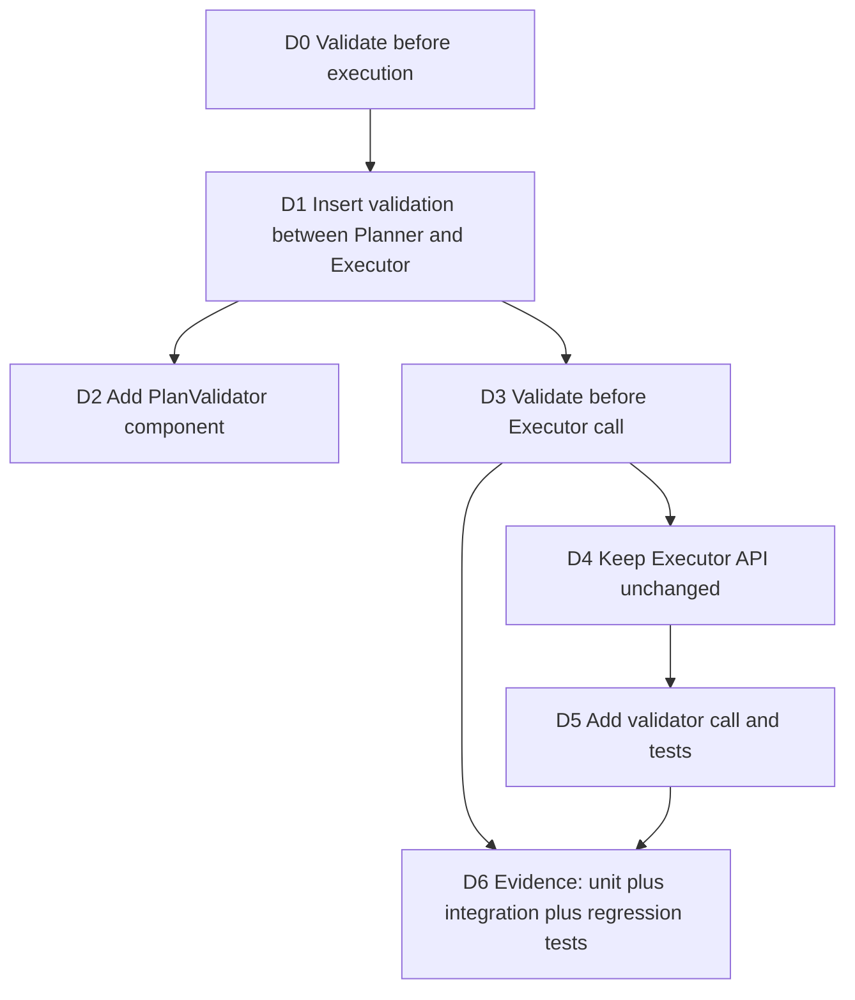
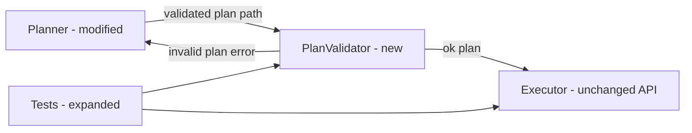
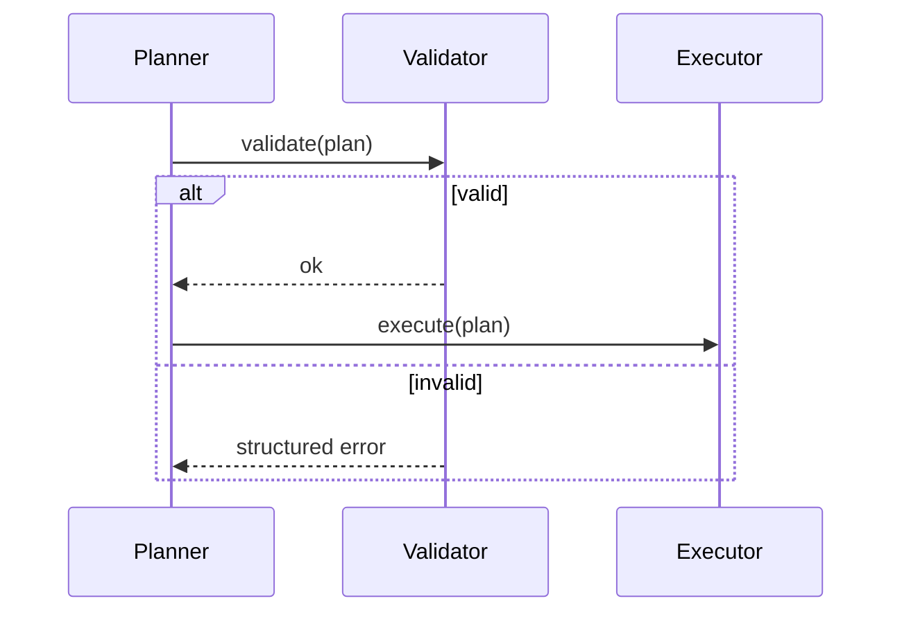

# Plan Viz Examples

## Example Input

Implement validation before executing a code-change plan.

Current behavior:
- Planner creates a plan.
- Executor directly executes the plan.
- Tests run after execution.

Proposed behavior:
- Add a PlanValidator.
- Planner sends plan to PlanValidator.
- PlanValidator checks risky operations.
- Executor only runs validated plans.
- Keep Executor public API unchanged.
- Add tests for valid plan, invalid plan, and unchanged executor behavior.

## Example Output Snippet

# Plan Viz

## 0. Audit Dashboard

**Goal:** Add validation before plan execution.
**Top-level architecture decision:** Insert validation between Planner and Executor.
**Main behavior change:** Executor receives only validated plans.
**Highest-risk decision:** Preserving Executor API while inserting validation.
**Likely touched files/modules:** `planner`, `executor`, new `plan_validator`, tests.
**Must-not-change behavior:** Existing Executor output contract.
**User audit focus:** D1, D3, D5

## 1. Decision Map

| Decision | Chosen | Depends On | Audit |
|---|---|---|---|
| D1 | Insert validation before Executor | D0 | [ ] correct insertion point |
| D2 | Add separate PlanValidator | D1 | [ ] boundary is worth it |
| D3 | Validate before execution | D1, D2 | [ ] runtime path intended |
| D4 | Keep Executor API unchanged | D3 | [ ] compatibility preserved |
| D5 | Add validator call and tests | D2-D4 | [ ] implementation is anchored |

## 2. Critical Views

### 2.1 Architecture Integration View

### 2.2 Runtime / Data Path View

## 3. Audit Checkpoints

- [ ] D1: Validation belongs between Planner and Executor.
- [ ] D2: Validator boundary is necessary and not over-engineered.
- [ ] D3: Runtime path rejects invalid plans before execution.
- [ ] D4: Executor public API remains compatible.
- [ ] D5: Implementation details trace to D1-D4.
- [ ] D6: Evidence covers valid, invalid, and old-behavior cases.
