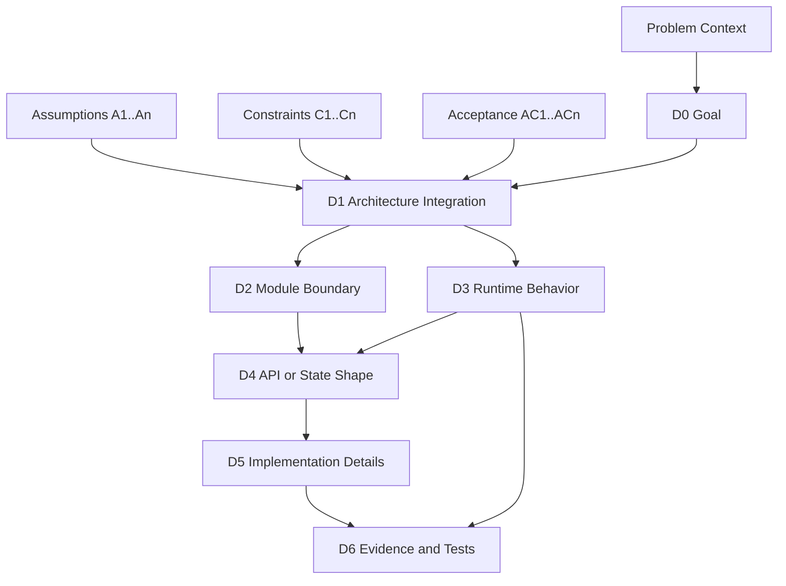

# TLDR Plan

## What this is NOT

This skill is **not** a plan validator. It does not approve, reject, or
audit the plan itself; it does not emit findings/severity tags. It does
not generate forward-looking ADRs or design specs. It does not check
post-implementation drift. It is also not a one-shot summarizer that
runs once and is done.

What it does: **distill** a raw implementation plan into a compact-first,
self-contained TLDR artifact (problem context, assumptions, scope, hard
constraints, D0–D6 decision trace, acceptance criteria, evidence, stop
conditions, and optional secondary diagrams). **Iterative by design**:
re-run after each plan revision. The flow is

```
plan v1 → tldr-plan v1 → human audit finds gaps
       → revise plan v2 → tldr-plan v2 → human audit
       → … → human audit passes → THEN hand the plan to a coding agent
```

`tldr-plan` is the audit surface, not the handoff event. Handoff is the
*destination* this skill helps reach; it is not a one-shot operation
this skill performs.

**Single reader: the human auditor.** The implementation agent does NOT
read this artifact — the agent reads the original plan file directly.
The human reviews the plan via tldr-plan, fixes issues in the plan,
re-runs tldr-plan on the revised plan, and only ships the plan (never
tldr-plan) to the agent once the audit passes.

**You are a plan translation layer.** You do not review, approve,
reject, or audit the plan yourself. You do not call the plan safe or
unsafe. You do not create a separate review report. You do not write
content addressed to the agent — assertions about agent behavior live
in the source plan, not here.

## Primary Goal: Pre-Ship Human Audit Artifact

The output must be readable by the human auditor without opening the raw plan. Do not require the reader to inspect the raw plan to verify:
- problem background and motivation
- key assumptions
- scope and constraints
- decision dependencies
- evidence requirements the plan defines
- stop conditions the plan defines for the agent

If important context is missing from the raw plan, write `unknown` and surface it in `## 7 Audit Checkpoints` so the human knows to fill the gap in the plan *before* shipping it to the agent.

Important framing for stop conditions and evidence: these sections describe what the *plan* tells the agent to do — they are **mirrors of plan content**, not new instructions to the agent. The human auditor uses them to verify the plan's stop / evidence story is adequate. If the plan does not define stop conditions, that is itself an audit finding, not something tldr-plan fabricates.

Diagrams are secondary. Use diagrams only when they make the decision system easier for the human to audit. Each diagram must answer one specific audit question (see Mermaid Rules).

## Invocation

The user should only need:

```text
/tldr-plan @PLAN.md
```

Also support:
- `/tldr-plan current plan`
- `/tldr-plan current diff`
- `/tldr-plan`

## Output File

Co-locate the output with the source plan, named with a `tldr` suffix
in the extension-style convention (mirrors `*.test.ts` / `*.spec.js`):

**Naming rule**: `<plan-dir>/<plan-stem>.tldr.md`

where `<plan-dir>` is `dirname(input plan path)` and `<plan-stem>` is
`basename(input plan path)` with the trailing `.md` stripped.

| Input plan path | Output |
|---|---|
| `plans/miles-port-unified-plan.md` | `plans/miles-port-unified-plan.tldr.md` |
| `claude/plans/giggly-tumbling-cook.md` | `claude/plans/giggly-tumbling-cook.tldr.md` |
| `docs/proposal.md` | `docs/proposal.tldr.md` |
| `PLAN.md` (no dir prefix) | `PLAN.tldr.md` |

Throughout this skill, `$OUT` denotes the derived output path and
`$STEM` denotes `<plan-stem>.tldr` (the basename without `.md`).
Substitute the actual derived values when running shell commands.

**Iterative re-runs against the SAME plan overwrite the same output
file** (intentional — the skill is designed for plan-revise / skill-rerun
loops). Different plans never collide because the stem differs.

**Edge cases**:

- Input plan stem already ends in `.tldr` (re-run on a TLDR by
  accident) → refuse with error: "input appears to be an existing
  TLDR; re-run the skill on the source plan instead." Do NOT silently
  produce `<name>.tldr.tldr.md`.
- Input plan path is read-only / outside the workspace tree (e.g.,
  `external/<vendor>/.../PLAN.md`) → write to `./<plan-stem>.tldr.md`
  in CWD with a console note explaining the relocation; user can move
  it later.
- No plan file supplied (`/tldr-plan`, `/tldr-plan current plan`,
  `/tldr-plan current diff` forms) → fallback `./current-plan.tldr.md`
  in CWD.

**Scratch dir for Mermaid validation** keys off the stem (not the dir)
to avoid concurrent-run collision: `tmp/<plan-stem>.tldr-mermaid-check/`.
The `tmp/` dir lives at workspace root regardless of where the source
plan sits.

If writing files is not available, print the full Markdown result in
the chat.

## Core Model

Code implementation is determined by a hierarchy of decisions:

```text
D0: Goal / Problem
D1: Architecture Integration
D2: Module Boundary
D3: Runtime Behavior
D4: Data / State / API Shape
D5: Implementation Details
D6: Evidence / Tests
```

Lower-level decisions must trace back to higher-level decisions.

Follow this translation order:

```text
why change
-> where the feature integrates into the architecture
-> how module boundaries are drawn
-> how runtime/data paths change
-> how API/state shape changes
-> how implementation details follow from those decisions
-> what evidence is needed to confirm the implementation did not drift
```

## Workflow

Extract in this order (do **not** start from diagrams):

1. Read the supplied plan. If no file is supplied, use the current plan or the user's latest plan-like content.
2. Infer the feature name when possible.
3. Extract context-first audit material in this fixed order:
   a. **Problem context** — current behavior, gap, why now, system-visible impact, non-obvious background.
   b. **Core assumptions** — implicit / explicit premises the plan depends on. Number `A1, A2, ...`.
   c. **Scope boundary** — in / out of scope, with rationale where the plan distinguishes "rejected alternative" from "out of scope".
   d. **Hard constraints** — fail-fast asserts, invariants, `must` / `必须`. Number `C1, C2, ...` (`FF1, FF2, ...` if the plan distinguishes fail-fast specifically).
   d.5. **Acceptance criteria — outcome-level (Tier 1)**. Number `AC1, AC2, ...`. Derivable from a–d alone (Goal / Assumptions / Scope / Constraints / Milestones); **must NOT reference any decision** (`Dn`). One row per outcome the plan promises a human at delivery time. If `## 3.3 Milestones` exists, group AC by milestone — milestones are the natural acceptance unit (a milestone is a sign-off boundary, a decision is not). Each AC is the answer to "what does the user actually receive when this is done?", written in user-visible terms, not designer-visible terms. The strict outcome-vs-mechanism boundary is what gives later decisions something to derive *from*; with no AC, decisions self-justify and over-engineering surfaces only at audit time.
   e. **Decision hierarchy D0–D6** — derived from a–d.5, not invented in isolation. Each `Dn` must cite at least one `AC` it serves. A `Dn` that cites no `AC` is either an undeclared goal (write the missing AC) or over-engineering (cut the decision).
   f. **Critical views** — only diagrams that answer a specific audit question.
   g. **Evidence required + stop conditions** — what to verify before "done"; what should halt the implementation. Each evidence row may bind to `D` (mechanism-level: "this decision is implemented") and/or `AC` (outcome-level: "this acceptance criterion is met"); both bindings together close the trace `AC → D → E`.
3a. **Scan for optional audit-pattern triggers (pattern activation pre-pass).**

    Run this scan *before* committing to D0-D6, because some triggers are surface markers that do not appear in the high-level decision graph (milestone tags, fail-fast asserts, wire-schema fields, etc.). Missing them at this stage means missing them entirely.

    Trigger rules:

    - Out-of-scope markers (`Out of Scope`, `不做`, `out-of-scope`, `non-goal`, `rejected alternative`, `已决边界`) → always produce `## 3.1 Out of Scope`. If silent, write `none declared` (silence is itself an audit signal).
    - Fail-fast asserts, critical invariants, `must` / `必须` constraints, startup validation blocks → produce a numbered `## 3.2 Hard Constraints` table (`C1`, `C2`, ... for hard contract; `FF1`, `FF2`, ... for fail-fast asserts specifically).
    - Phase / milestone / version tags (`M11.x`, `Phase 1`, `v2`, `Week 1`, `gate N`) → produce a single canonical `## 3.3 Milestones` table.
    - A single decision with ≥3 named alternatives shipped under different conditions (transports, backends, algorithms) → produce a `## 3.4 Strategy Comparison` matrix.
    - Hardware/resource words in the goal (`GPU`, `node`, `port`, `file descriptor`, `NUMA`, `socket`, `lane`, `rank`, `worker`, `shard`) where topology affects correctness, placement, scheduling, ownership, or lifecycle → add `### 2.3 Physical Topology View` to Critical Views.
    - New wire / RPC / HTTP / callback / event / config schemas → produce `## Appendix F: Activated Pattern Details` with a Wire-Format Quick Reference table.
    - Subsystems with independent lifecycle and ≥3 meaningful states (router admission, cache slot, port pool, scheduler queue, worker, connection) → produce a `stateDiagram-v2` in Appendix F. Promote to Critical Views only when lifecycle correctness is one of the top audit risks.
    - Cross-cutting role/path dimensions (`rank × role`, `phase × component`, `transport × path`) → produce a role matrix in Appendix F, or visible section if it is central.
    - Rejected alternatives / "已决边界" / design tradeoffs scattered through the plan → consolidate into `## 3.1 Out of Scope` (rejection rationale) and `## 3.4 Strategy Comparison` (alternatives table). Do not duplicate across appendices.
    - **Alternative-axis numbering in source plan** (e.g. `F1..F12` features, `Component A..G`, `Workstream 1..N`, `Module M1..Mk`) different from the D0–D6 decision axis → produce a **navigation crosswalk table in `Appendix F`** so an auditor familiar with the source plan can jump from `F4` (their mental handle) to the right `D` rows in tldr-plan. Format: `| Source-axis ID | Primary D | Secondary D | Notes |`. Without this crosswalk, auditors waste time guessing where their `Fn` lives in the audit doc.

    When a trigger fires, include the corresponding pattern. When it does not fire, omit the pattern and do not invent placeholder content. Do not invent a fake topology for a software-only plan or fabricate constraints to fill `## 3.2`.
4. Mark inferred decisions with `(inferred)`.
5. Mark missing information as `unknown`.
6. Mark low-level implementation details with no clear parent decision as `unanchored`.
7. Generate a compact visible audit surface.
8. Put full traceability in visible appendix sections.
9. Write the result to `<plan-dir>/<plan-stem>.tldr.md` (see `## Output File` for derivation rule, edge cases, and fallback). Throughout the rest of this skill, `$OUT` denotes that path and `$STEM` denotes `<plan-stem>.tldr`; substitute the actual derived values when running shell commands.
9a. **Citation-grid integrity check (mandatory before mechanical validation).** Before running the Mermaid validator, audit the citation grid for orphan IDs and trace/visible drift. Programmatic check:

    ```bash
    # Every D ID in Appendix A's trace MUST appear in §5 Decision Map (DAG + table).
    # Drift here means visible region under-represents a decision the trace claims exists.
    python3 -c '
    import re, sys
    t = open("$OUT").read()  # $OUT = derived output path, see ## Output File
    # Pull all D-IDs from the Appendix A table.
    appA_start = t.find("## Appendix A")
    appB_start = t.find("## Appendix B")
    appA = t[appA_start:appB_start] if appA_start >= 0 and appB_start >= 0 else ""
    trace_ids = set(re.findall(r"\bD\d(?:\.[A-Z])?", appA))
    # Pull all D-IDs from §5 Decision Map.
    s5_start = t.find("## 5. Decision Map")
    s6_start = t.find("## 6.")
    s5 = t[s5_start:s6_start] if s5_start >= 0 and s6_start >= 0 else ""
    visible_ids = set(re.findall(r"\bD\d(?:\.[A-Z]|[A-Z])?", s5))
    # Normalize D3.A vs D3A spelling differences before comparing.
    norm = lambda s: {x.replace(".", "") for x in s}
    orphans = norm(trace_ids) - norm(visible_ids)
    if orphans:
        print(f"ORPHAN: trace IDs not in §5: {sorted(orphans)}")
        sys.exit(1)
    print("citation grid OK")
    '
    ```

    Apply the same eyeball check for `Cn`, `An`, `En`, `Mn`, `ACn`: every ID defined in its canonical table should appear in at least one cross-reference. If any ID is orphaned, either add a cross-reference or remove it from its canonical table — never leave it dangling.

    **AC integrity (HARD FAIL — extends the orphan check above)**: the AC layer (§3.5 ↔ §5 `AC served` ↔ §6.1 `AC verified`) has additional bidirectional rules. Any violation hard-fails Step 9a (exit 1; do not advance to Step 10).

    ```bash
    python3 -c '
    import re, sys
    t = open("$OUT").read()  # $OUT = derived output path, see ## Output File
    def slice_section(start_marker, end_marker):
        s = t.find(start_marker)
        e = t.find(end_marker, s + 1) if s >= 0 else -1
        return t[s:e] if s >= 0 and e >= 0 else ""

    s35 = slice_section("### 3.5", "### 4")          # also handles "## 4"
    if not s35:
        s35 = slice_section("## 3.5", "## 4")
    s5  = slice_section("## 5. Decision Map", "## 6.")
    s61 = slice_section("#### 6.1", "#### 6.2")
    if not s61:
        s61 = slice_section("## 6.1", "## 6.2")

    AC_TOKEN = r"\bAC[1-9][0-9]*\b"

    # 1. extract canonical ACn from §3.5 ID column (first column of pipe-table rows)
    ac_defined = set()
    for line in s35.splitlines():
        m = re.match(r"\|\s*(AC[1-9][0-9]*)\s*\|", line)
        if m: ac_defined.add(m.group(1))

    # 2. §3.5 Derives-from allow-list: only Goal | A\d+ | C\d+ | M\S+
    forbidden_in_derives = []
    for line in s35.splitlines():
        cells = [c.strip() for c in line.split("|")]
        # Derives-from is the 3rd data column: row = | ID | Outcome | Derives | Verified | Milestone |
        if len(cells) >= 5 and re.match(r"AC[1-9][0-9]*", cells[1]):
            derives = cells[3]
            tokens = re.findall(r"`?([A-Za-z][A-Za-z0-9_.]*)`?", derives)
            for tok in tokens:
                if tok in {"Goal"}: continue
                if re.match(r"^A[1-9][0-9]*$", tok): continue
                if re.match(r"^C[1-9][0-9]*$", tok): continue
                if re.match(r"^M\S+$", tok): continue
                forbidden_in_derives.append((cells[1], tok))

    # 3. §5 AC served: every Dn row must have ≥1 AC token; tokens ⊆ ac_defined
    d_without_ac = []
    ac_cited_by_d = set()
    for line in s5.splitlines():
        m = re.match(r"\|\s*(D[0-9](?:\.[A-Za-z])?)\s*\|", line)
        if not m: continue
        cells = [c.strip() for c in line.split("|")]
        # Decision table: | Decision | Chosen | Depends | AC served | Audit |
        if len(cells) < 6: continue
        ac_served = cells[4]
        toks = set(re.findall(AC_TOKEN, ac_served))
        if not toks:
            d_without_ac.append(m.group(1))
        ac_cited_by_d |= toks

    # 4. §6.1 AC verified aggregate: every ac_defined must appear in ≥1 row
    ac_covered_by_e = set()
    for line in s61.splitlines():
        m = re.match(r"\|\s*(E[1-9][0-9]*)\s*\|", line)
        if not m: continue
        cells = [c.strip() for c in line.split("|")]
        # Evidence table: | ID | Binds to | AC verified | Evidence | Before Done? |
        if len(cells) < 6: continue
        ac_covered_by_e |= set(re.findall(AC_TOKEN, cells[3]))

    # Report + fail
    fail = False
    orphans_d = ac_defined - ac_cited_by_d
    if orphans_d:
        print(f"FAIL: AC not cited by any Dn (orphan promises): {sorted(orphans_d)}"); fail = True
    orphans_e = ac_defined - ac_covered_by_e
    if orphans_e:
        print(f"FAIL: AC not covered by any En (unverifiable promises): {sorted(orphans_e)}"); fail = True
    if d_without_ac:
        print(f"FAIL: Dn rows with empty AC served (orphan decisions): {sorted(d_without_ac)}"); fail = True
    if forbidden_in_derives:
        print(f"FAIL: §3.5 Derives-from has forbidden tokens (allow-list = Goal | An | Cn | Mn): {forbidden_in_derives}"); fail = True
    sys.exit(1 if fail else 0)
    print("AC integrity OK")
    '
    ```

    The mutation table below is the integrity-check spec — verify against a 1-AC / 1-D / 1-E worked example to sanity-check before committing changes that touch AC layout:

    | Mutation | Expected exit |
    |---|---|
    | Remove the only `AC1` from §5 `AC served` (D1 has no AC) | 1 |
    | Remove the only `AC1` from §6.1 `AC verified` (AC uncovered) | 1 |
    | Change §3.5 `Derives from` to `Goal, D1` (forbidden token) | 1 |
    | Change `AC1` ID in §3.5 to `AC 1` (format inconsistent across tables) | 1 |
    | All four tables consistent, no orphans, no forbidden tokens | 0 |

10. **Mechanical Mermaid validation (mandatory before finishing).** Do not declare the file complete until every Mermaid block in `$OUT` compiles (`$OUT` = the derived output path from Step 9; e.g., `plans/miles-port-unified-plan.tldr.md`). `$STEM` denotes `<plan-stem>.tldr` (e.g., `miles-port-unified-plan.tldr`). Eyeballing is not a substitute for the parser. Run:

    ```bash
    OUT=<plan-dir>/<plan-stem>.tldr.md  # substitute the actual derived path
    STEM=<plan-stem>.tldr               # used only for tmp scratch dir naming
    rm -rf "tmp/${STEM}-mermaid-check" && mkdir -p "tmp/${STEM}-mermaid-check"
    node -e 'const fs=require("fs"); const t=fs.readFileSync(process.env.OUT,"utf8"); let i=0; for (const m of t.matchAll(/```mermaid\n([\s\S]*?)\n```/g)) { i++; fs.writeFileSync(`tmp/${process.env.STEM}-mermaid-check/diagram-${i}.mmd`, m[1]); } console.log(`extracted ${i}`);'
    fail=0
    for f in "tmp/${STEM}-mermaid-check"/*.mmd; do
      if npx -y @mermaid-js/mermaid-cli -i "$f" -o "${f%.mmd}.svg" -b transparent >/dev/null 2>&1; then
        echo "OK  $f"
      else
        echo "FAIL $f"; fail=1
        npx -y @mermaid-js/mermaid-cli -i "$f" -o "${f%.mmd}.svg" -b transparent 2>&1 | grep -A2 "Error: Parse"
      fi
    done
    [ $fail -eq 0 ] || echo "MERMAID VALIDATION FAILED"
    ```

    If any block reports `FAIL`, edit `$OUT`, re-run the loop, and repeat until every block reports `OK`. Common parser errors traced back to syntax in `## Mermaid Rules`. The `tmp/${STEM}-mermaid-check/` directory is scratch; leave it (or delete it) — do not commit it. If `npx`/`node` is unavailable, state that the mechanical check could not run and ask the user how to proceed instead of skipping the step silently.

## Output Layout

Always generate full traceability, but use a compact-first layout.

The top-level visible document is the human auditor's pre-ship review surface. From top to bottom it serves five purposes (all from the auditor's perspective — the implementation agent never reads this file):

1. **Triage** (`## 0 Audit Dashboard`) — 30 seconds: is this plan relevant, urgent, risky?
2. **Background** (`## 1 Problem Context`, `## 2 Assumptions`) — why does this plan exist, what does it presume?
3. **Contract** (`## 3 Scope & Constraints`) — what's in/out, what must hold, milestones, alternatives.
4. **Design** (`## 4 Critical Views`, `## 5 Decision Map`, `## 6 Evidence & Stop Conditions`) — how is the work structured and what does the plan say verifies it.
5. **Pre-ship gate** (`## 7 Audit Checkpoints`) — what the human auditor ticks before shipping the plan to the implementation agent.

Put exhaustive details in visible appendix sections. Do not wrap appendices in `<details>`, `<summary>`, collapsed sections, zipped blocks, or hidden content. The appendix is part of the audit surface — folding makes it one click away from grep / diff review and defeats the purpose. Compact-first means *short visible top*, not *hidden bottom*.

### Conditional Collapse Rules

To prevent small plans from being padded with empty section shells, sections are tagged `always` or `conditional`. The default is **collapse** when no signal supports a conditional section.

Always visible (regardless of plan size):
- `## 0 Audit Dashboard`
- `## 3.1 Out of Scope` (write `none declared` if silent)
- `## 4 Critical Views` with at least `## 4.1 Architecture Integration View`
- `## 5 Decision Map`
- `## 7 Audit Checkpoints`

Conditional — include only when the corresponding signal is present:

| Section | Include when |
| ------- | ------------ |
| `## 1 Problem Context` | plan has > 3 lines of problem-statement-shaped prose (gap, motivation, current vs desired). If signal is weaker, fold its substance into Dashboard's Goal field and skip the section. |
| `## 2 Assumptions` | ≥ 3 distinct assumption IDs survive extraction. If only 1–2, fold them into `## 3.2 Hard Constraints` table as `(assumption)` rows and skip. |
| `## 3.2 Hard Constraints` | plan has fail-fast asserts, invariants, or `must` / `必须` constraints. |
| `## 3.3 Milestones` | staged delivery exists (M11.x, Phase 1, v2, gate N). |
| `## 3.4 Strategy Comparison` | a single decision has ≥ 3 named alternatives shipped under different conditions. |
| `## 4.2 Runtime / Data Path View` | runtime behavior changes are central to the audit (most non-trivial plans). Skip for pure refactors with no behavior delta. |
| `## 4.3 Physical Topology View` | hardware/resource words in goal AND topology affects correctness. |
| `## 6 Evidence & Stop Conditions` | plan defines evidence, gates, or test gates explicitly. If silent, list stop conditions only and put any inferable evidence rows in Appendix C; skip `## 6` heading entirely. |
| `## Appendix F` | any workflow 3a trigger fired that did not fit a visible section. |

When collapsing, do not leave empty headings — remove the heading entirely. An empty `## 1 Problem Context` heading is worse than no heading: it creates the illusion of missing content.

## Proportional Visible Surface

The visible surface is the audit surface, not the full trace. Its size is content-specific and should scale with the raw plan.

Do not enforce fixed line counts, node counts, edge counts, diagram counts, or checkbox counts. A large or highly coupled plan may need a larger visible surface.

Compact-first rules:
- Do not add preamble between `# TLDR Plan` and `## 0. Audit Dashboard`, except optional `Feature:` and `Source:` lines.
- Audit Dashboard: use the requested dashboard fields, each as a single line when possible.
- Decision DAG: include the decision nodes needed to preserve the plan's real hierarchy.
- Decision table: include the rows needed to audit top-down decision traceability.
- Architecture Integration View: show the components needed to understand insertion points and boundaries.
- Runtime / Data Path View: show the actors, states, or data paths needed to understand the critical behavior.
- Visible prose after each critical view should explain only what the diagram cannot show.
- Audit Checkpoints should cover the plan's important decision surfaces, not an arbitrary count.

Placement rules:
- Keep details visible when they are necessary to audit the decision hierarchy.
- Move details to visible appendices when they are exhaustive traceability, implementation inventory, rationale, or evidence matrix content.
- For large plans, group files into module families in the visible surface unless exact paths are needed for audit.
- Group features into decision clusters in the visible surface unless feature-level separation changes the decision graph.
- Include implementation constants, env vars, patch filenames, timeout values, and port details in visible diagrams only when they are themselves important decisions.
- Put long rejected-alternative lists, detailed invariants, detailed error paths, and fallback paths in visible appendices unless they are central audit surfaces.
- If a diagram becomes too large to audit as one view, split it into focused visible views or keep a compressed primary view and put the exhaustive trace in a visible appendix.

Use exactly this document structure. Sections marked `<!-- conditional -->` appear only when the corresponding signal is present (see `### Conditional Collapse Rules` above). Empty conditional sections must be removed entirely, not left as placeholder headings.

```markdown
# TLDR Plan

Feature: **...**
Source: [...]

## 0. Audit Dashboard

## 1. Problem Context
<!-- conditional: > 3 lines of problem-statement-shaped prose; else fold into Dashboard.Goal -->

## 2. Assumptions
<!-- conditional: >= 3 distinct A IDs; else fold into 3.2 as (assumption) rows -->

## 3. Scope & Constraints

### 3.1 Out of Scope
<!-- always include; write "none declared" if plan is silent -->

### 3.2 Hard Constraints
<!-- conditional: fail-fast / invariant / must constraints exist; numbered C1..Cn / FF1..FFn -->

### 3.3 Milestones
<!-- conditional: staged delivery exists; single canonical table -->

### 3.4 Strategy Comparison
<!-- conditional: one decision has >=3 named alternatives -->

### 3.5 Acceptance Criteria
<!-- always include; outcome-level (Tier 1); group by milestone if 3.3 exists; -->
<!-- "Derives from" column may only cite §0–§3 IDs (Goal, A, C, M); never cite Dn here -->

## 4. Critical Views

### 4.1 Architecture Integration View

### 4.2 Runtime / Data Path View
<!-- conditional: behavior-changing plan; skip for pure refactor -->

### 4.3 Physical Topology View
<!-- conditional: hardware/resource layout in goal AND topology affects correctness -->

## 5. Decision Map

## 6. Evidence & Stop Conditions
<!-- conditional: plan defines evidence/test gates explicitly; else inline stop conditions and skip heading -->

## 7. Audit Checkpoints

## Appendix A: Full Decision Trace

...

## Appendix B: Full Module / File Boundary

...

## Appendix C: Full Risk -> Evidence Matrix
<!-- risk-driven cut; complementary to decision-driven §6 -->

...

## Appendix D: Implementation Detail Trace

...

## Appendix E: Execution Anchors

...

## Appendix F: Activated Pattern Details
<!-- conditional: include only triggered patterns from workflow 3a that did not fit a visible section -->
<!-- candidates: Wire-Format Quick Reference, Sub-system State Machine, Cross-cutting Role Matrix, Expanded Topology Notes, Expanded Strategy Comparison, Expanded Milestone Notes -->

...
```

The visible region order — `0 Dashboard → 1 Context → 2 Assumptions → 3 Scope & Constraints (3.1 Out of Scope → 3.2 Hard Constraints → 3.3 Milestones → 3.4 Strategy Comparison → 3.5 Acceptance Criteria) → 4 Critical Views → 5 Decision Map → 6 Evidence & Stop Conditions → 7 Audit Checkpoints` — is fixed: triage first, background next, **contract (including outcome-level acceptance) before design**, design before evidence, evidence before checklist. Do not reorder.

Why §3.5 sits inside the contract (§3) and before §5 Decisions: acceptance criteria are outcome-level promises to the human, derivable from Goal+Assumptions+Constraints+Milestones alone. They MUST be expressible without any reference to design decisions — that is the test that separates "what we owe the user" from "how we propose to build it". Decisions in §5 then derive **from** §3.5 (each `Dn` cites the `ACn` it serves), which closes the loop `AC → D → E` and exposes orphan decisions (a `Dn` with no `AC` is either over-engineering or a hidden goal).

Why Dashboard precedes Context: Dashboard is a 30-second triage view (`Goal / risk / files / focus`) that lets the reader decide whether the plan is relevant *before* committing to read the background. Context expands the Dashboard's `Goal` and `User audit focus` fields, it does not replace them.

Why Decision Map (`## 5`) follows Critical Views (`## 4`): the diagrams are the intuitive on-ramp; the DAG is the audit tool. Onboarding readers absorb visuals first; auditors then drill into the DAG to verify dependencies.

§6 vs Appendix C — both list evidence but cut differently:
- `## 6 Evidence & Stop Conditions` is **decision-driven**: each row binds to a `D / A / C / M` ID and answers "what must I verify before declaring this decision implemented?". Compact list, ~5–10 rows.
- `Appendix C: Risk -> Evidence Matrix` is **risk-driven**: each row binds to a risk description and answers "if this risk fires, what catches it?". Long table, comprehensive.

Never duplicate rows across §6 and Appendix C — pick the cut where the row most naturally belongs and leave a one-line cross-reference if needed.

## Section Requirements

### 0. Audit Dashboard

Use the fields below. Keep each field concise, but do not drop important content just to meet a fixed size.

Include:
- Goal
- Top-level architecture decision
- Main behavior change
- Highest-risk decision (cite `Dn`)
- Highest-risk assumption (cite `An`)
- Highest-risk constraint (cite `Cn`)
- Most important decision to audit first (cite `Dn`)
- Likely touched files/modules (one line; defer detail to Appendix B)
- Must-not-change behavior
- User audit focus

**Compactness target: ≤ 12 lines total.** Each bullet should fit one wrapped line at typical viewport width. If a bullet runs long, collapse to a single-line summary and defer detail to a downstream appendix (e.g. `Likely touched module families` should NOT enumerate full paths — say `MILES side: rollout / backends / router / examples; RLix side: 4 new files; SGLang vendored patches. See Appendix B.`).

Do not include long rationale. Use module families instead of long file lists. The Dashboard exists to serve 30-second triage; if it cannot be absorbed in 30 seconds, it has failed its purpose regardless of how complete it is.

### 1. Problem Context (conditional)

Include only when the source plan has > 3 lines of problem-statement-shaped prose (gap, motivation, current vs desired). If the signal is weaker, fold its substance into the Dashboard `Goal` field and skip this section.

Format — concise prose or labeled bullets, **8–12 lines max**:

- **Current system behavior** — what the system does today.
- **Problem / gap** — what's missing or broken.
- **Why now** — what triggered this plan (deadline, incident, dependency, opportunity).
- **System-visible or user-visible impact** — what fails or degrades if nothing is done.
- **Existing architecture context** — adjacent systems / contracts the plan relies on.
- **Non-obvious background** — load-bearing assumptions about prior incidents, conventions, or environment that the audit needs but the plan does not restate.

Do not include long project history, retrospective rationale, or unrelated background. Each line earns its place by being something an auditor would otherwise have to dig out of the raw plan.

### 2. Assumptions (conditional)

Include only when ≥ 3 distinct assumption IDs survive extraction. If only 1–2, fold them into `## 3.2 Hard Constraints` table as `(assumption)` rows and skip this section entirely.

Use the table:

| ID | Assumption | Why it matters | Evidence / check | If it fails |
| -- | ---------- | -------------- | ---------------- | ----------- |
| A1 | ... | ... | ... | ... |

Rules:
- Number `A1, A2, A3, ...`. The numbers are citation handles for `## 6 Evidence & Stop Conditions` and the decision rows.
- "If it fails" must be concrete: which decision becomes invalid, which constraint is violated, which behavior breaks.
- If an assumption is not verified by anything in the plan, mark `Evidence / check` as `unverified` and add a corresponding row to `## 7 Audit Checkpoints`.

### 3. Scope & Constraints

This is the audit *contract*: what is in / out of scope, what hard constraints must hold, what milestones gate delivery, what alternatives were considered. Sub-sections appear per workflow 3a triggers.

#### 3.1 Out of Scope (always include)

Bullet list of items the plan explicitly excludes. If the plan is silent, write `none declared` — the absence is itself an audit signal.

Pull in items from rejected-alternatives lists, "non-goal" callouts, and "已决边界" sections so they live in one canonical place.

#### 3.2 Hard Constraints (conditional)

Numbered table of fail-fast asserts, critical invariants, and `must` / `必须` constraints. Use `C1, C2, ...` for hard contract; `FF1, FF2, ...` when the plan distinguishes fail-fast asserts specifically.

| ID | Constraint | Enforced by | Source |
| -- | ---------- | ----------- | ------ |

Numbers are **citation handles** — PR review must be able to write "violates C5". Unnumbered prose constraints decay; do not leave them only in prose.

#### 3.3 Milestones (conditional)

Single canonical table for staged delivery. Other sections may cite milestone IDs but must not redefine them.

| Milestone | Scope | Key deliverables | Gates |
| --------- | ----- | ---------------- | ----- |

#### 3.4 Strategy Comparison (conditional)

Side-by-side matrix when one decision has ≥3 named alternatives shipped under different conditions (transports, backends, algorithms).

| Alternative | When chosen | Trade-off | Status |
| ----------- | ----------- | --------- | ------ |

#### 3.5 Acceptance Criteria (always include)

**Outcome-level (Tier 1)** acceptance criteria the plan promises a human at delivery time. Numbered `AC1, AC2, ...` (flat — milestone membership lives in the `Milestone` column, not the ID). Single canonical table, sorted by milestone then ID.

**Hard rule** (`Derives from` allow-list): the `Derives from` column may cite `Goal`, `An`, `Cn`, `Mn` — and **only** these. `Dn`, `En`, `Risk*`, `OpenQuestion*` are forbidden. AC are written before decisions exist; the moment an AC needs `Dn` to make sense, it is mechanism-level and belongs in `## 6.1 Evidence Required`, not here. Step 9a hard-fails on any forbidden token.

**ID format guarantee**: `ACn` token must appear verbatim (regex `\bAC[1-9][0-9]*\b`) in three places — the `ID` column here, the `AC served` column in §5, the `AC verified` column in §6.1. Inconsistent spelling (`AC 1` vs `AC1`) is a Step 9a fail.

| ID | Acceptance Criterion (outcome) | Derives from | Verified by | Milestone |
| -- | ------------------------------ | ------------ | ----------- | --------- |
| AC1 | MILES fullasync GRPO runs end-to-end under RLix scheduler (single pipeline) | `Goal`, `A1`, `M11.1` | `E3` | M11.1 |
| AC2 | trajectory `weight_versions` consumable by `--max-weight-staleness` | `A8`, `C13` | `E5` | M11.1 |

`Verified by` references `E` IDs in §6.1 and closes bidirectional traceability `AC ↔ E`.

✅ outcome-level: user-visible at delivery (`AC1` above).
❌ mechanism-level: implementation detail (`per-bucket payload doesn't carry weight_version` — belongs in §6.1, not here).

If §3.3 is absent, use `Milestone = (none)` for all rows. If the plan is silent on user-visible outcomes, write `(plan does not declare outcome-level AC — see §7)` as a single placeholder row and surface as an `Intent` audit checkpoint demanding the human declare AC explicitly in the **plan** before shipping.

### 4. Critical Views

Include the visible diagrams needed to audit the architecture and runtime decisions. Prefer two views for normal plans, but add or split views when the source plan needs it. Each diagram must answer one specific audit question; if you cannot state the question, the diagram does not belong here.

#### 4.1 Architecture Integration View

Purpose:
Show where the new feature fits into existing architecture.

Use a Mermaid flowchart with before/after or modified/new/stable components.
Show component groups by default, but show individual classes, files, or actors when those boundaries are themselves decisions.

Include:
- Architectural insertion point
- Existing component touched
- New component added
- Stable components that should not change
- Downstream decisions unlocked

Rejected alternatives belong in visible Appendix A unless they are central to the architecture decision.

#### 4.2 Runtime / Data Path View (conditional)

Skip for pure refactor plans with no runtime behavior delta. Otherwise include.

Purpose:
Show how critical behavior changes.

Use:
- `sequenceDiagram` for component interactions over time
- `flowchart` for pipeline/control-flow changes
- `stateDiagram` for state-machine changes

Include:
- Before path
- After path
- Invariants
- Error/fallback path if relevant
- Data/state transition if relevant

Show the critical path and any branches needed for audit. Move detailed invariants, timeout handling, cleanup paths, and failure matrices to visible Appendices C and E unless they are central visible decisions.

#### 4.3 Physical Topology View (conditional)

Required when the plan's goal involves hardware or resource layout (GPUs, nodes, ports, file descriptors, NUMA, sockets, lanes, ranks, workers, shards) **and** topology affects correctness, placement, scheduling, ownership, or lifecycle.

Use a Mermaid `flowchart` with subgraphs grouped by physical container (e.g. `GPU 0 / GPU 1 / Node 0`). Overlay logical roles (`actor_train`, `actor_infer`, `router`, `scheduler`, `worker`, `cache slot`) as named nodes inside the appropriate physical container.

If logical roles overlap on the same physical resource, show the overlap explicitly rather than duplicating it in unrelated diagrams. ASCII art is acceptable when Mermaid cannot express overlap clearly (e.g. `actor_train ⊂ actor_infer` GPU lane).

Skip software-only plans. Forbidden to invent a fake topology to fill the slot.

### 5. Decision Map

Include:
1. One Mermaid decision DAG
2. One compact decision table

The decision DAG should show D0-D6 and the dependency edges between decisions, **and** trace decisions back to the Context (`Ctx`), Assumptions (`A1..An`), Constraints (`C1..Cn`), and **Acceptance Criteria (`AC1..ACn`)** that derive them. Decisions are not invented in isolation; the DAG must show what they are derived from. AC is a source node alongside `Ctx / A / C` — edges flow `AC --> Dn`, never the reverse (decisions serve commitments, they don't create them).

For complex plans, make the DAG a decision hierarchy, not a line-by-line feature inventory.

Use this Mermaid style:



Adapt the DAG to the actual plan.
Do not force all nodes if the plan lacks relevant content, but keep the D0-D6 structure when possible.
Include multiple nodes at the same D layer when the plan has multiple independent decision branches that the human must audit separately.
Use short labels. Avoid file paths, patch filenames, env vars, and implementation constants in visible node labels.

The compact decision table should use:

| Decision | Chosen | Depends On (Ctx / A / C / Dn) | AC served | Audit |
| -------- | ------ | ----------------------------- | --------- | ----- |

**Cite rule (HARD)**: every `Dn` row's `AC served` cell must contain ≥1 `ACn` token (verbatim, regex `\bAC[1-9][0-9]*\b`, comma-separated for multiple). A `Dn` with empty `AC served` is either undeclared-goal (add the missing AC to §3.5 first) or over-engineering (cut the decision). Step 9a hard-fails on any `Dn` with empty `AC served`.

### 6. Evidence & Stop Conditions (conditional)

Include this visible section only when the source plan defines evidence, gates, or test gates explicitly. Otherwise list stop conditions inline at the end of `## 7 Audit Checkpoints` and skip the `## 6` heading entirely.

**This section mirrors what the plan tells the agent — it does not invent new instructions.** The human auditor uses it to verify that the plan's evidence and stop-condition story is adequate. If the plan does not define stop conditions or evidence, mirror that gap honestly (`unknown`, or "plan does not define") and surface it as an audit checkpoint so the human knows to fix the plan before shipping.

This section is **decision-driven** — each row binds to a `D / A / C / M` ID and answers "what does the plan say must be verified before this decision is considered implemented?". Compact list, ~5–10 rows. The risk-driven cut lives in `Appendix C` and is never duplicated here.

#### 6.1 Evidence Required (per plan)

| ID | Binds to (D / A / C / M) | AC verified | Evidence the plan defines | Before Done? |
| -- | ------------------------ | ----------- | ------------------------- | ------------ |
| E1 | D1 | AC1 | ... | yes |
| E2 | C5 |  | ... | yes |
| E3 | A2 | AC2 | startup validation confirms assumption | yes |

Number `E1, E2, E3, ...`. Reference the corresponding `D`, `A`, `C`, `M` IDs in `Binds to` so the citation grid stays connected. If a decision / constraint / assumption has no corresponding evidence in the plan, write `(plan does not define)` and surface it in `## 7 Audit Checkpoints`.

**`AC verified` column**: comma-separated `ACn` tokens (verbatim, regex `\bAC[1-9][0-9]*\b`). Empty per row is fine — not every E binds to AC; some E rows verify mechanism-level decisions only (E2 above is mechanism-only). What is enforced is **aggregate coverage**: across all E rows in this table, every `ACn` declared in §3.5 must appear in ≥1 row's `AC verified` cell. Step 9a hard-fails if any AC is uncovered.

#### 6.2 Stop Conditions (per plan)

Bullet list of stop conditions the **plan tells the agent** to honor. Prefix with `The plan instructs the agent to stop and ask if:` to make the source unambiguous.

Sample (adapt to the actual plan):

- the plan says: stop if assumption A1 or A2 fails during implementation
- the plan says: stop if implementation requires touching out-of-scope files
- the plan says: stop if a hard constraint (C*) cannot be enforced as written
- the plan says: stop if tests require changing expected old behavior
- (plan does not define a stop condition for D5 implementation details lacking parent decision — audit gap, see `## 7`)

If the plan defines no stop conditions at all, write `The plan defines no stop conditions.` and add a checkpoint to `## 7` flagging this as an audit finding the human should address before shipping the plan to the agent.

### 7. Audit Checkpoints

Generate the human audit checkboxes the auditor ticks **before shipping the plan to the implementation agent**. Always last in the visible region. Two lenses:

1. **Intent alignment** — does the plan reflect what the human actually wants?
2. **Shippability** — is the plan complete enough that an agent reading it (without tldr-plan) will not have to guess?

Use this style:

- [ ] **Intent**: problem context (`## 1` or Dashboard.Goal) reflects the human's actual motivation.
- [ ] **Intent**: scope boundary (3.1) excludes the right things; rejected alternatives are intentional.
- [ ] **Intent**: D1 architecture insertion point matches the human's intended integration.
- [ ] **Intent**: assumptions A1–An are ones the human is willing to bet on; `unverified` items are acceptable risks.
- [ ] **Intent**: AC1–ACn (§3.5) cover what the human auditor expects to receive at each milestone — no missing user-visible outcomes.
- [ ] **Shippability**: hard constraints C1–Cn are present in the plan with enforcement points (the agent will encounter them).
- [ ] **Shippability**: every `Dn` in §5 cites ≥1 `AC` in §3.5 (no orphan decisions; a `Dn` with no `AC` is either over-engineering or a hidden goal).
- [ ] **Shippability**: every `AC` in §3.5 has at least one `D` citing it AND at least one `E` verifying it (no orphan promises, no unverifiable promises).
- [ ] **Shippability**: D2/D3/D4/D5 layers trace to parents in the plan; no orphan implementation details that an agent might invent freely.
- [ ] **Shippability**: the plan defines stop conditions for the agent (`## 6.2` mirrors them); gaps surfaced here.
- [ ] **Shippability**: the plan defines evidence / acceptance criteria (`## 6.1` mirrors them); gaps surfaced here.
- [ ] **Shippability**: must-not-change behaviors (Dashboard) are explicit in the plan, not just in tldr-plan.

Adapt the wording to the actual plan. When `## 3.2 Hard Constraints` exists, include checkpoint(s) of the form `Cn is encoded in the plan as an enforced assertion`. When `## 6` exists, include a checkpoint of the form `Evidence E1–En is achievable before the agent declares done`. When the plan has gaps that tldr-plan exposed (`unknown` markers), each one becomes an `Intent` or `Shippability` checkpoint demanding the human update the *plan*, not tldr-plan.

Do not say `safe` or `unsafe`. Do not approve or reject.

## Appendix Section Requirements

The final document uses top-level appendix headings:

```markdown
## Appendix A: Full Decision Trace
## Appendix B: Full Module / File Boundary
## Appendix C: Full Risk -> Evidence Matrix
## Appendix D: Implementation Detail Trace
## Appendix E: Execution Anchors
## Appendix F: Activated Pattern Details   <!-- conditional -->
```

Do not add a wrapper heading named `## Appendices`. Do not fold any appendix into `<details>` / `<summary>` — see `## Output Layout`.

### Appendix A: Full Decision Trace

Include full table:

| Decision | Layer | Chosen | Rejected | Depends On | Unlocks | User Audit |
| -------- | ----- | ------ | -------- | ---------- | ------- | ---------- |

Mark inferred decisions as `(inferred)`.
Mark missing information as `unknown`.

### Appendix B: Full Module / File Boundary

Include full table:

| File / Module | Role | Allowed Change | Forbidden Responsibility | Parent Decision |
| ------------- | ---- | -------------- | ------------------------ | --------------- |

Forbidden responsibility is mandatory.
If unclear, infer conservative boundaries and mark them `(inferred)`.

### Appendix C: Full Risk -> Evidence Matrix

Include full table:

| Decision | Risk | Required Evidence | Stop Condition |
| -------- | ---- | ----------------- | -------------- |

Evidence can include:
- unit test
- integration test
- regression test
- benchmark
- assertion
- log/metric
- manual check
- compatibility test

Do not claim risk is mitigated.
Only list required evidence.

### Appendix D: Implementation Detail Trace

Include table:

| Implementation Detail | Parent Decision | Reason | Drift Risk |
| --------------------- | --------------- | ------ | ---------- |

Rules:
- Include low-level details only if they affect structure, behavior, state, lifecycle, compatibility, or tests.
- Mark details with no clear parent decision as `unanchored`.
- Do not expand trivial naming or formatting choices.

### Appendix E: Execution Anchors

Include:
- Allowed Changes
- Forbidden Changes
- Stop Conditions
- Done Criteria

Stop Conditions are mandatory.

**Done Criteria — leading machine-checkable line per milestone (mandatory)**: each milestone subsection must START with a single line of the form `Done(Mn) = AC<i> ∧ AC<j> ∧ ...` referencing the AC IDs from §3.5 that constitute "done" for that milestone. Existing prose (gates, deliverables, signoff narrative) follows the line for context. Each `ACn` referenced must exist in §3.5 with `Milestone = Mn` (or be explicitly cross-cut between milestones with a comment). Step 9a does not yet enforce Done-line vs §3.5 cross-cite, but the format is fixed so future regen runs and downstream tooling have a stable shape to parse.

Example:
```markdown
### Done(M11.1) = AC1 ∧ AC2 ∧ AC4 ∧ AC7

<existing prose: M11.1 done = Gates 1, 2, 2.5, 3 pass + reload_process_groups stable + ... >

### Done(M11.2) = AC3 ∧ AC8

<prose: M11.2 done = Gate 4 happy path (c)+(d)+(e) pass + ... >
```

If the plan defines no milestones, use a single `### Done = AC1 ∧ AC2 ∧ ...` line at the top of Done Criteria. If §3.5 has only the placeholder row (`plan does not declare outcome-level AC`), write `### Done = (plan does not declare outcome-level AC — see §3.5 + §7)` and surface as an Intent audit checkpoint.

**Stop-condition voice (must match `## 6.2`).** Use *mirror* language consistently — `## 6.2` and Appendix E both describe what the *plan* tells the agent, not what tldr-plan tells the agent. Use the prefix `The plan instructs the agent to stop and ask if:` (or `The plan defines no stop conditions for ...`). Do NOT use `Stop and ask the user if:` (legacy template language) — it reads as a direct instruction to the agent and contradicts the single-reader rule.

Use this style:

```markdown
The plan instructs the agent to stop and ask if:

- implementation requires touching out-of-scope files
- a lower-level implementation decision lacks a parent decision
- required tests force changing expected old behavior
- the architecture insertion point appears wrong after code inspection
- public API compatibility must be broken to implement the plan
```

If a category of stop condition the human auditor would expect is missing from the source plan, mirror that gap honestly:

```markdown
- (the plan defines no stop condition for X — audit gap, see `## 7 Audit Checkpoints`)
```

### Appendix F: Activated Pattern Details (conditional)

Include only the patterns that workflow 3a triggered but did not fit into a visible section. Each sub-section is itself conditional — omit the entire appendix if no triggered pattern needs detail expansion.

Candidate sub-sections:

- **Wire-Format Quick Reference** — table for new RPC / HTTP / callback / event / config schemas. Columns: `Field | Type | Source | Consumer | Notes`. One row per field.
- **Sub-system State Machine** — `stateDiagram-v2` for any subsystem with ≥3 meaningful states and independent lifecycle (router admission, cache slot, port pool, scheduler queue, worker, connection). Skip 2-state on/off.
- **Cross-cutting Role Matrix** — table when roles × paths form a meaningful grid (e.g. `tp_rank × transport_mask`, `phase × component`, `role × milestone`). Use a row per role, column per path.
- **Expanded Topology Notes** — supplementary text for the Physical Topology View when ASCII art alone is insufficient.
- **Expanded Strategy Comparison** — when `## 3.4 Strategy Comparison` is too compact to show implementation-level differences.
- **Expanded Milestone Notes** — per-milestone scope expansions when `## 3.3 Milestones` rows are too short to capture key invariants.

## Mermaid Rules

Use Mermaid diagrams when they improve auditability.
Prefer focused diagrams over large diagrams.

Allowed visible diagrams:
- Decision DAG
- Architecture Integration View
- Runtime / Data Path View
- Physical Topology View (only when workflow 3a triggers it)

Additional diagrams must go into visible appendices (Appendix F).

For subsystems with independent lifecycle, use `stateDiagram-v2` only when the lifecycle has at least 3 meaningful states (router admission, cache slot, port pool, scheduler queue, worker, connection). Place it in `## Appendix F: Activated Pattern Details` by default. Promote to Critical Views only when lifecycle correctness is one of the top audit risks. Skip trivial 2-state on/off lifecycles.

Use simple labels.
All important arrows must be directional.
Label important arrows when useful.
Avoid decorative diagrams.
Keep visible diagrams small enough to inspect at a glance.

**Each diagram must answer one specific audit question.** If you cannot state the question in one sentence (e.g. "where does the new feature integrate into the existing architecture?", "how does request routing change after admission close?", "which logical roles share GPU 0?"), the diagram does not belong in the document. Put a one-line statement of the question immediately above each diagram, in italics or as a comment.

Audit-question reference per view:

| View | Audit question |
| ---- | -------------- |
| Architecture Integration | Where does the new feature attach to existing architecture, and what stays unchanged? |
| Runtime / Data Path | How does a critical path's behavior change? |
| Physical Topology | Which logical roles map to which physical resources, and where do they overlap? |
| Decision DAG | Which assumptions and constraints derive each decision? |
| Sub-system State Machine | Is the lifecycle complete and all transitions accounted for? |
| Wire-format Quick Reference | What does each new schema field mean, who produces it, who consumes it? |

Avoid Mermaid syntax traps:
- Do not use lowercase `end` as a node label.
- Use short node IDs.
- Avoid punctuation-heavy node IDs.
- Put complex labels inside brackets or quotes.
- Do not use HTML tags such as `<br/>`, `<sub>`, `<sup>`, or `<span>` inside any Mermaid diagram. Use plain text, shorter labels, separate nodes, or prose outside the diagram instead.
- Avoid Markdown formatting inside diagram text. Put detailed formatting in the prose below the diagram.
- For multi-line labels, prefer separate nodes, shorter aliases, or Mermaid-native quoted labels. Do not rely on HTML line breaks.
- In `sequenceDiagram`, be extra strict: participants, notes, and messages should be plain single-line text.
- **No `;` semicolons inside `Note over ...` text.** Mermaid's sequence parser treats `;` as a statement terminator and silently splits the note, producing confusing parse errors that point at the *next* line (e.g. `got NEWLINE` where it expected an arrow). Use `and`, `,`, or split into two notes.
- Avoid free-standing `=` and other operator-looking glyphs in `Note` text (e.g. `x = 3`). Prefer wording like `set x to 3`. The parser sometimes treats them as the start of a participant or arrow token, again producing errors that appear to be on the *following* line.
- In `sequenceDiagram` arrow lines, the message after `:` is plain text, but parens, brackets, and `=` can still tokenize unexpectedly. Keep arrow messages short and descriptive (`request_cluster_gpus actor_train step3`) rather than literal call signatures (`request_cluster_gpus(actor_train, ACTOR_TRAINING, step=3)`).
- When the parser reports an error on a line that looks fine, check the *previous* `Note` / arrow message — almost always the real culprit.

## Length Rules

Default to full content with compact visible surface.

Do not optimize for a fixed visible length. Optimize for content-specific auditability: enough visible structure to inspect the real decision graph, with exhaustive trace details placed in visible appendices.

Move these to visible appendices:
- long rationale
- exhaustive file lists
- detailed risks
- edge cases
- implementation detail trace
- alternative designs
- test matrix
- detailed invariants
- detailed failure paths
- feature-by-feature inventories

Do not translate the raw plan line by line.
Do not generate every possible diagram.
Only visualize decisions that help human audit or prevent implementation drift.

## Style Rules

Use direct, technical language.
Prefer tables, diagrams, and checkboxes over prose.
Use `unknown` when the plan lacks information.
Use `(inferred)` when deriving decisions from context.
Use `unanchored` when an implementation detail lacks a parent decision.

**Citation grid.** Use stable IDs so cross-references survive editing and PR review can reference them precisely. Each ID type has one canonical definition table:

| Kind | ID | Defined in | Used by |
| ---- | -- | ---------- | ------- |
| Assumption | `A1, A2, ...` | `## 2 Assumptions` | `## 3.5 AC`, `## 5 Decision Map`, `## 6 Evidence`, `## 7 Audit Checkpoints` |
| Hard constraint | `C1, C2, ...` | `## 3.2 Hard Constraints` | `## 3.5 AC`, `## 5`, `## 6`, `## 7`, `Appendix C` |
| Fail-fast assert | `FF1, FF2, ...` | `## 3.2` (when distinguished from hard contract) | same as `C` |
| Acceptance criterion | `AC1, AC2, ...` | `## 3.5 Acceptance Criteria` | `## 5` (AC served column), `## 6.1` (AC verified column), `## 7`, `Appendix E` (Done lines) |
| Decision | `D0..D6` | `## 5 Decision Map` | `## 6`, `## 7`, all appendices |
| Milestone | `M11.x / Phase N / vN` | `## 3.3 Milestones` | `## 3.5 AC` (Milestone column), decision rows, evidence rows, audit checkpoints, Appendix E Done lines |
| Evidence | `E1, E2, ...` | `## 6.1 Evidence Required` | `## 3.5 AC` (Verified by column), `## 7 Audit Checkpoints`, Appendix C cross-ref |

Define each ID exactly once in its canonical table. Other sections cite by ID only — do not redefine the content.

Cross-reference whenever possible. Examples:
- `D3 depends on A2 and C2; first delivered in M11.2`
- `E4 verifies C5 and A3`
- `Implementation detail I7 (Appendix D) must not violate FF2`
- `Appendix C row "broadcast group leak" cross-references E2`

Unnumbered prose constraints decay; do not leave them only in prose.

**Citation-grid integrity (no orphan IDs).** Every ID that appears in any canonical table MUST also appear in at least one cross-reference, AND every ID that appears in a *trace table* (Appendices A / C / D) MUST also appear in the corresponding *visible* table or diagram. Concrete checks:

- For every row in `Appendix A: Full Decision Trace`, the decision ID MUST appear in `## 5 Decision Map` (both the DAG node *and* the compact decision table). If `Appendix A` lists `D3.F` but `## 5` only has `D3A..D3E`, the visible region is silently under-representing a decision the trace says exists. Either add the node to the DAG or remove it from the trace; never let them drift.
- For every `ACn` in `## 3.5 Acceptance Criteria`, at least one `Dn` row in `## 5` MUST cite it in the `AC served` column AND at least one `En` row in `## 6.1` MUST cite it in the `AC verified` column (orphan AC = unfulfilled or unverifiable promise; Step 9a hard-fails). Conversely, every `Dn` row in `## 5` MUST cite ≥1 AC in its `AC served` cell (orphan decision = over-engineering or hidden goal).
- For every constraint `Cn` in `## 3.2`, at least one row in `Appendix C: Risk → Evidence Matrix` or `## 6.1 Evidence Required` should reference it (otherwise the constraint has no verification handle).
- For every assumption `An` in `## 2`, at least one row in `## 6.2 Stop Conditions` or `## 7 Audit Checkpoints` should reference it (otherwise no one notices when the assumption fails).
- For every evidence ID `En` in `## 6.1`, at least one checkpoint in `## 7` should reference it (otherwise the evidence has no audit handle).
- For every milestone `M*` in `## 3.3`, at least one `ACn` row or decision row or evidence row should cite it (otherwise the milestone is a label without obligations). Appendix E `Done(M*)` lines must reference only `ACn` IDs that exist in `## 3.5`.

Before declaring the document complete, do a final pass over each canonical table and grep the rest of the document for the IDs. Orphan IDs are the most common silent decay path.

When the plan has milestone tags, **define them once** in the canonical `## 3.3 Milestones` table. Other sections (decision rows, evidence matrix, audit checkpoints) may cite milestone IDs but must not redefine the scope.

Do not:
- approve the plan
- reject the plan
- call it safe or unsafe
- create a separate review
- perform implementation
- change source code
- hide, collapse, zip, or fold appendix content (compact-first means short visible top, not hidden bottom)

## References

Read these only when useful:
- `references/output-template.md` for the canonical output skeleton.
- `references/examples.md` for a compact worked example.
