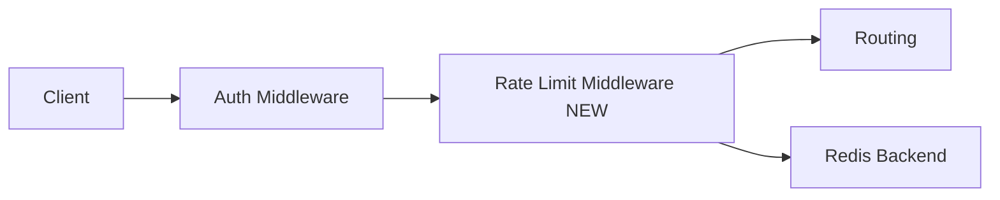

# TLDR Plan

Feature: **Per-tenant rate limit middleware**
Source: examples/fixture-valid-source.md (synthetic — for self-test only)

## 0. Audit Dashboard

- Goal: per-tenant rate limit cache to prevent one tenant from starving others
- Top-level architecture decision: middleware between auth and routing
- Main behavior change: HTTP 429 on tenant overflow with Retry-After
- Highest-risk decision: D3 (fail-closed on Redis outage)
- Highest-risk assumption: A1 (X-Tenant-Id header reliably present)
- Highest-risk constraint: C1 (untagged request → 400)
- Most important decision to audit first: D3
- Likely touched files/modules: `middleware/rate_limit.py` (new); `redis/client.py` (existing)
- Must-not-change behavior: existing auth middleware semantics
- User audit focus: D3 fail-closed semantics + AC3 outage test
- Artifact integrity: AC-grid pass; Mermaid pass (1 block in §4.1 compiles)

## 2. Assumptions

| ID | Assumption | Why it matters | Evidence / check | If it fails |
| -- | ---------- | -------------- | ---------------- | ----------- |
| A1 | `X-Tenant-Id` header always present after auth | required for D2 cache key | C1 (F10 assert) | untagged traffic bypasses budget |
| A2 | single Redis backend sufficient (no multi-region) | scopes MVP | declared in plan | scaling to multi-region needs new design |
| A3 | tenant config table includes per-tenant budget | runtime lookup works | unverified | rate limiter cannot read budget |

## 3. Scope & Constraints

### 3.1 Out of Scope

- Multi-region cache replication (deferred)
- Generic policy DSL for ops-defined rules (out of scope)

### 3.2 Hard Constraints

| ID | Constraint | Enforced by | Source |
| -- | ---------- | ----------- | ------ |
| C1 | request without `X-Tenant-Id` returns 400 before cache lookup | middleware entry assert | spec line 12 |
| C2 | overflow returns 429 with Retry-After header | counter overflow check | spec line 18 |
| C3 | cache key must include tenant_id (no cross-tenant collision) | key format `rl:{tenant}:{minute}` | spec line 24 |
| C4 | Redis outage returns 503 (fail closed) | exception handler | spec line 30 |

### 3.3 Acceptance Criteria

| ID | Acceptance Criterion (outcome) | Derives from | Verified by | Milestone |
| -- | ------------------------------ | ------------ | ----------- | --------- |
| AC1 | two tenants in parallel — A exhausting budget does not affect B's budget | Goal, A1 | E1 | M1 |
| AC2 | burst exceeding budget receives 429 with p99 < 1ms | Goal, C2 | E2 | M1 |
| AC3 | cache outage produces 503 (not silent pass-through) | Goal, C4 | E3 | M1 |

### 3.4 Milestones

| Milestone | Scope | Key deliverables | Delivers AC | Gates |
| --------- | ----- | ---------------- | ----------- | ----- |
| M1 | First build | middleware + Redis backend + tests | `AC1 ∧ AC2 ∧ AC3` | Gate 1 |

## 4. Critical Views

### 4.1 Architecture Integration View

## 5. Decision Map

| Decision | Chosen | Depends On | AC served | Audit |
| -------- | ------ | ---------- | --------- | ----- |
| D1 | middleware insertion between auth and routing | A1 | AC1 | confirm chain order |
| D2 | Redis INCR with TTL on first creation | C3 | AC1, AC2 | test counter independence |
| D3 | fail-closed on Redis outage (503) | C4 | AC3 | fault injection test |

## 6. Evidence & Stop Conditions

### 6.1 Evidence Required (per plan)

| ID | Binds to | AC verified | Evidence the plan defines | Before Done? |
| -- | -------- | ----------- | ------------------------- | ------------ |
| E1 | D2 | AC1 | two-tenant parallel integration test | yes |
| E2 | D2 | AC2 | load test 1000 req/s for 5s, p99 latency | yes |
| E3 | D3 | AC3 | fault injection (kill Redis), assert 503 | yes |

### 6.2 Stop Conditions

The plan instructs the agent to stop and ask if:

- A1 fails (header missing in production)
- A3 fails (tenant config not available)
- D3 cannot be implemented as fail-closed

## 7. Audit Checkpoints

- [ ] Intent: scope boundary §3.1 excludes the right things.
- [ ] Shippability: every Dn cites ≥1 AC.
- [ ] Shippability: every AC has D and E coverage.
