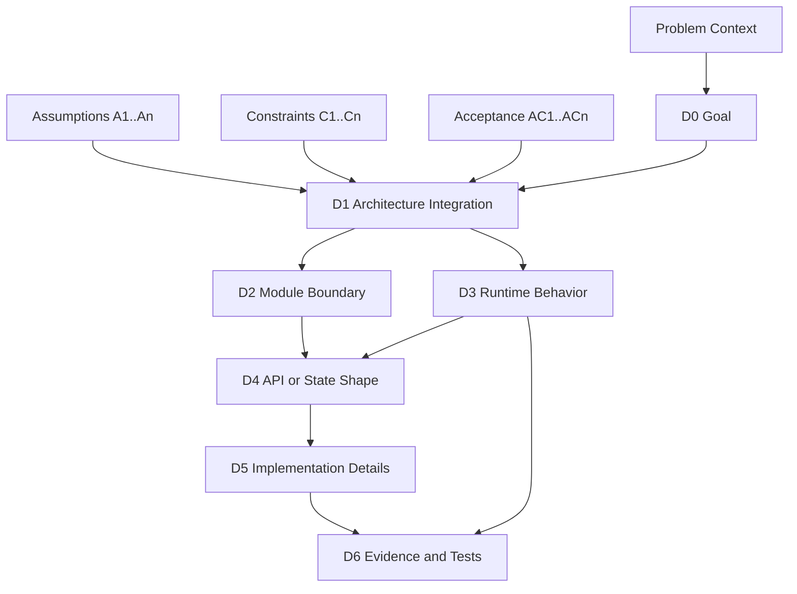

# Output Layout — full template

Top-level visible document for human auditor. Five purposes (in order):

1. **Triage** (`## 0 Audit Dashboard`) — 30-second relevance check
2. **Background** (`## 1 Problem Context`, `## 2 Assumptions`) — why this exists
3. **Contract** (`## 3 Scope & Constraints`) — in/out scope, must-hold rules, milestones, alternatives
4. **Design** (`## 4 Critical Views`, `## 5 Decision Map`, `## 6 Evidence & Stop Conditions`) — how it's structured + verification
5. **Pre-ship gate** (`## 7 Audit Checkpoints`) — human ticks before agent handoff

Put exhaustive details in **visible** appendix sections. Do not wrap appendices in `<details>` / `<summary>` / collapsed blocks — folding makes them grep/diff-invisible.

## Conditional Collapse Rules

Default = **collapse** when no signal supports a conditional section. Sections marked `always` appear regardless of plan size; sections marked `conditional` only when the trigger fires (workflow Step 3a).

**Always visible**:
- `## 0 Audit Dashboard`
- `## 3.1 Out of Scope` (write `none declared` if silent)
- `## 4 Critical Views` with at least `## 4.1 Architecture Integration View`
- `## 5 Decision Map`
- `## 7 Audit Checkpoints`

**Conditional** — include only when signal is present:

| Section | Include when |
| ------- | ------------ |
| `## 1 Problem Context` | plan has > 3 lines of problem-statement-shaped prose. If signal weaker, fold into Dashboard.Goal. |
| `## 2 Assumptions` | ≥ 3 distinct assumption IDs. If 1–2, fold into `## 3.2` as `(assumption)` rows. |
| `## 3.2 Hard Constraints` | plan has fail-fast asserts / invariants / `must` constraints. |
| `## 3.4 Milestones` | staged delivery exists (M11.x, Phase 1, v2, gate N). If absent, AC table at §3.3 uses `Milestone = (none)`. |
| `## 3.5 Strategy Comparison` | one decision has ≥ 3 named alternatives shipped under different conditions. |
| `## 4.2 Runtime / Data Path View` | runtime behavior changes are central (most non-trivial plans). Skip pure refactors. |
| `## 4.3 Physical Topology View` | hardware/resource words in goal AND topology affects correctness. |
| `## 6 Evidence & Stop Conditions` | plan defines evidence/test gates explicitly. If silent, list stop conditions inline at §7 and skip §6 heading. |
| `## Appendix F` | any workflow Step 3a trigger fired that did not fit a visible section. |
| `## Appendix G` | (NEW) `unknown` markers or audit-checkpoint gaps exist — see Plan Patch Suggestions section below. |

When collapsing, **remove the heading entirely** — empty `## 1 Problem Context` heading is worse than no heading.

## Mode-aware behavior (compact / standard / complex)

The `--mode=` flag adjusts which sections render:

| Mode | Must include | May omit |
|---|---|---|
| `compact` | §0 Dashboard, §3 Scope (3.1+3.3 condensed), §7 Audit Checkpoints (gaps only), Appendix G (if patches needed) | Mermaid DAG, §3.4 if no staged delivery, §3.5, §4.2/4.3, §5 Decision Map can be table-only (no DAG), Appendix A-E |
| `standard` (default) | current default minimal trace (all visible region §0-§7, Appendix A-D conditional) | Topology Appendix F |
| `complex` | all visible region + critical views + Appendix A-F + Appendix G if gaps + AC integrity + mermaid validation | nothing unless plan is genuinely silent |

**Canonical anchor invariant** — even compact mode MUST preserve these section anchors (used by `check_tldr_integrity.py` and downstream `scope-triage`):

- `### 3.3 Acceptance Criteria`
- `## 5. Decision Map` (table form OK; DAG optional in compact)
- `#### 6.1 Evidence Required` when AC rows exist
- `### 3.4 Milestones` when staged delivery exists

Compact mode reduces *content density* (no Mermaid DAG, condensed prose, omittable Appendix A-E) but does NOT remove canonical section *anchors*. Integrity script treats absent optional sections as "not required" not "malformed", and skips Mermaid validation when no Mermaid blocks present.

## Document skeleton

Use exactly this structure. Sections marked `<!-- conditional -->` appear only per the Conditional Collapse Rules table above.

```markdown
# TLDR Plan

Feature: **...**
Source: [...]

## 0. Audit Dashboard

## 1. Problem Context
<!-- conditional -->

## 2. Assumptions
<!-- conditional -->

## 3. Scope & Constraints

### 3.1 Out of Scope
<!-- always; "none declared" if silent -->

### 3.2 Hard Constraints
<!-- conditional -->

### 3.3 Acceptance Criteria
<!-- always; outcome-level (Tier 1); REQUIREMENT axis -->

### 3.4 Milestones
<!-- conditional; SCHEDULE axis -->

### 3.5 Strategy Comparison
<!-- conditional -->

## 4. Critical Views

### 4.1 Architecture Integration View

### 4.2 Runtime / Data Path View
<!-- conditional -->

### 4.3 Physical Topology View
<!-- conditional -->

## 5. Decision Map

## 6. Evidence & Stop Conditions
<!-- conditional -->

## 7. Audit Checkpoints

## Appendix A: Full Decision Trace
## Appendix B: Full Module / File Boundary
## Appendix C: Full Risk -> Evidence Matrix
## Appendix D: Implementation Detail Trace
## Appendix E: Plan-Mirrored Execution Anchors (auditor view)
## Appendix F: Activated Pattern Details
<!-- conditional; Step 3a triggers -->

## Appendix G: Plan Patch Suggestions
<!-- conditional; only when unknown markers / audit-checkpoint gaps exist -->
```

## Section requirements

### 0. Audit Dashboard

Compactness target: ≤ 13 lines. Each bullet one wrapped line.

Include:
- Goal
- Top-level architecture decision
- Main behavior change
- Highest-risk decision (cite `Dn`)
- Highest-risk assumption (cite `An`)
- Highest-risk constraint (cite `Cn`)
- Most important decision to audit first (cite `Dn`)
- Likely touched files/modules (one line; defer detail to Appendix B)
- Must-not-change behavior
- User audit focus
- **Artifact integrity**: AC-grid `<pass | fail | not-run>`; Mermaid `<pass | fail | skipped:no-blocks | skipped:npx-missing>`. (Records the result of Workflow Step 9a `check_tldr_integrity.py` and Step 10 `validate_mermaid.sh`. This is **artifact integrity, not source-plan validation** — `pass` means the AC-D-E citation grid is internally consistent and Mermaid blocks compile, NOT that the source plan is approved.)

Defer detail to downstream appendices — say `MILES side: rollout / backends / router / examples; RLix side: 4 new files. See Appendix B.`

**`Artifact integrity` value mapping** (skill writer fills in based on actual exit codes):

| Tool | Exit code | Dashboard value |
|---|---|---|
| `check_tldr_integrity.py` | 0 | `AC-grid pass` |
| `check_tldr_integrity.py` | 1 | `AC-grid fail` |
| `check_tldr_integrity.py` | not run | `AC-grid not-run` |
| `validate_mermaid.sh` | 0 (with blocks) | `Mermaid pass` |
| `validate_mermaid.sh` | 0 (no blocks) | `Mermaid skipped:no-blocks` |
| `validate_mermaid.sh` | 1 | `Mermaid fail` |
| `validate_mermaid.sh` | 2 | `Mermaid skipped:npx-missing` |

### 1. Problem Context (conditional)

Format — concise prose or labeled bullets, **8–12 lines max**:

- **Current system behavior** — what the system does today
- **Problem / gap** — what's missing or broken
- **Why now** — what triggered this plan (deadline, incident, dependency)
- **System-visible / user-visible impact** — what fails if nothing done
- **Existing architecture context** — adjacent systems / contracts the plan relies on
- **Non-obvious background** — load-bearing assumptions about prior incidents / conventions / environment

### 2. Assumptions (conditional)

Table:

| ID | Assumption | Why it matters | Evidence / check | If it fails |
| -- | ---------- | -------------- | ---------------- | ----------- |

Rules:
- `A1, A2, ...` numbered; cite handles for §6 + decision rows
- "If it fails" is concrete (which decision invalid / which constraint violated)
- If unverified by anything in plan, mark `Evidence / check = unverified` and add §7 checkpoint
- **If assumption is enforced by §3.2 Cn**, point `Evidence / check` to that Cn — A row carries narrative; C row carries machine-checkable form

### 3.1 Out of Scope (always — PRODUCT BOUNDARY axis)

Bullet list. If silent, `none declared`.

Pull from rejected-alternatives, "non-goal" callouts, "已决边界" sections — one canonical place.

Phrasing: **feature-named** ("X not supported in this milestone", "Y deferred to M11.5"). If §3.1 entry has §3.2 runtime guardrail, intentional overlap — §3.1 uses product-boundary form, §3.2 uses checkable form.

### 3.2 Hard Constraints (conditional — RUNTIME GUARDRAIL axis)

Table:

| ID | Constraint | Enforced by | Source |
| -- | ---------- | ----------- | ------ |

`C1, C2, ...` for hard contract; `FF1, FF2, ...` for fail-fast asserts specifically.

**Phrasing rule (HARD)**: write each constraint as a **checkable predicate** the implementer can lift into an `assert`. Vague phrasing ("not supported") belongs in §3.1.

Examples:

| ❌ Vague (§3.1) | ✅ Checkable (§3.2) |
|---|---|
| `MoE / EP not supported` | `expert_model_parallel_size == 1 and moe_router_topk == 0` |
| `Async save breaks the port` | `not args.async_save` |

### 3.3 Acceptance Criteria (always — REQUIREMENT axis)

Outcome-level (Tier 1). Numbered `AC1, AC2, ...` flat.

| ID | Acceptance Criterion (outcome) | Derives from | Verified by | Milestone |
| -- | ------------------------------ | ------------ | ----------- | --------- |

`Derives from` allow-list is **strict**: `Goal | An | Cn` ONLY. `Mn` / `Dn` / `En` / `Risk*` / `OpenQuestion*` are forbidden. AC describes what the user receives at delivery, derivable from Goal+Assumptions+Constraints alone.

`Verified by` references `E*` IDs in §6.1 — closes `AC ↔ E` traceability.
`Milestone` references `M*` IDs in §3.4 (forward-ref OK). Scheduling join, not derivation.

If §3.4 absent, `Milestone = (none)` for all AC rows. If plan is silent on user-visible outcomes, write `(plan does not declare outcome-level AC — see §7)` and surface as `Intent` audit checkpoint.

### 3.4 Milestones (conditional — SCHEDULE axis)

| Milestone | Scope | Key deliverables | Delivers AC | Gates |
| --------- | ----- | ---------------- | ----------- | ----- |

`Delivers AC` column: comma-separated `ACn` IDs (or `∧`-joined for narrative). Every `ACn` cited must exist in §3.3 with same `Mn` in its `Milestone` column (bidirectional consistency).

Empty `Delivers AC` is label-without-obligations — Step 9a flags as gap (future-tagged milestones with `(future)` in `Scope` are exempted).

### 3.5 Strategy Comparison (conditional)

| Alternative | When chosen | Trade-off | Status |
| ----------- | ----------- | --------- | ------ |

### 4. Critical Views

Each diagram answers ONE specific audit question. State the question above the diagram.

#### 4.1 Architecture Integration View

Mermaid `flowchart` with before/after or modified/new/stable components. Show:
- Architectural insertion point
- Existing component touched
- New component added
- Stable components that should not change
- Downstream decisions unlocked

#### 4.2 Runtime / Data Path View (conditional)

`sequenceDiagram` / `flowchart` / `stateDiagram` for behavior changes. Show before path, after path, invariants, error/fallback if relevant.

#### 4.3 Physical Topology View (conditional)

Mermaid `flowchart` with subgraphs by physical container (`GPU 0` / `Node 0` / etc.). Overlay logical roles. Show overlap explicitly. Skip software-only plans.

### 5. Decision Map

One Mermaid decision DAG + one compact decision table.

DAG style:



Decision table:

| Decision | Chosen | Depends On (Ctx / A / C / Dn) | AC served | Audit |
| -------- | ------ | ----------------------------- | --------- | ----- |

**Cite rule (HARD)**: every `Dn` row's `AC served` cell must contain ≥1 `ACn` token (verbatim). Empty `AC served` = orphan decision (over-engineering or hidden goal). Step 9a hard-fails.

### 6. Evidence & Stop Conditions (conditional)

This section **mirrors what the plan tells the agent** — does NOT invent new instructions.

#### 6.1 Evidence Required (per plan)

| ID | Binds to (D / A / C / M) | AC verified | Evidence the plan defines | Before Done? |
| -- | ------------------------ | ----------- | ------------------------- | ------------ |

`E1, E2, ...` numbered. `Binds to` cites `D`/`A`/`C`/`M` IDs.

`AC verified` aggregate coverage rule: across all E rows, every `ACn` in §3.3 must appear in ≥1 row's `AC verified`. Step 9a hard-fails on uncovered AC.

#### 6.2 Stop Conditions (per plan)

Bullet list with prefix `The plan instructs the agent to stop and ask if:`.

If plan defines no stop conditions, write `The plan defines no stop conditions.` and surface as §7 checkpoint.

### 7. Audit Checkpoints

Always last in visible region. Two lenses: Intent + Shippability.

```markdown
- [ ] **Intent**: problem context (§1 or Dashboard.Goal) reflects human's actual motivation.
- [ ] **Intent**: scope boundary (§3.1) excludes the right things.
- [ ] **Intent**: assumptions A1-An are bets the human is willing to make.
- [ ] **Intent**: AC1-ACn (§3.3) cover what the human expects to receive at each milestone.
- [ ] **Shippability**: every Dn in §5 cites ≥1 AC in §3.3 (no orphan decisions).
- [ ] **Shippability**: every AC in §3.3 has ≥1 D citing it AND ≥1 E verifying it.
- [ ] **Shippability**: hard constraints C1-Cn are present in plan with enforcement points.
- [ ] **Shippability**: D2-D5 layers trace to parents in plan; no orphan implementation details.
- [ ] **Shippability**: plan defines stop conditions (§6.2 mirrors them).
- [ ] **Shippability**: must-not-change behaviors (Dashboard) are explicit in plan.
```

When `## 6` exists, include `Evidence E1-En achievable before agent declares done`.

When plan has gaps that tldr-plan exposed (`unknown` markers), surface each as `Intent` or `Shippability` checkpoint demanding the human update the *plan*.

If Appendix G has rows, add: `See Appendix G for concrete source-plan patch suggestions.`

## Appendix Section Requirements

### Appendix A: Full Decision Trace

| Decision | Layer | Chosen | Rejected | Depends On | Unlocks | User Audit |
| -------- | ----- | ------ | -------- | ---------- | ------- | ---------- |

Mark inferred decisions `(inferred)`. Mark missing info `unknown`.

### Appendix B: Full Module / File Boundary

| File / Module | Role | Allowed Change | Forbidden Responsibility | Parent Decision |
| ------------- | ---- | -------------- | ------------------------ | --------------- |

Forbidden Responsibility is mandatory.

### Appendix C: Full Risk -> Evidence Matrix

| Decision | Risk | Required Evidence | Stop Condition |
| -------- | ---- | ----------------- | -------------- |

Evidence types: unit test / integration test / regression test / benchmark / assertion / log/metric / manual check / compatibility test.

Do not claim risk is mitigated. Only list required evidence.

### Appendix D: Implementation Detail Trace

| Implementation Detail | Parent Decision | Reason | Drift Risk |
| --------------------- | --------------- | ------ | ---------- |

Mark unanchored details `unanchored`.

### Appendix E: Plan-Mirrored Execution Anchors (auditor view)

This appendix mirrors execution anchors found in the source plan. **It is not a new instruction set for the implementation agent — agents must read the source plan directly.**

Include:
- Allowed Changes
- Forbidden Changes
- Stop Conditions (mirror voice)
- Done Criteria

**Done Criteria — leading machine-checkable line per milestone (mandatory)**:

```markdown
### Done(M11.1) = AC1 ∧ AC2 ∧ AC4 ∧ AC7

<existing prose: M11.1 done = Gates 1, 2, 2.5, 3 pass + ...>

### Done(M11.2) = AC3 ∧ AC8

<prose: ...>
```

If plan defines no milestones, single `### Done = AC1 ∧ AC2 ∧ ...` line. If §3.3 has only placeholder row, `### Done = (plan does not declare outcome-level AC — see §3.3 + §7)`.

**Stop-condition voice (mirror)**: use `The plan instructs the agent to stop and ask if:` consistently. Do NOT use `Stop and ask the user if:` (legacy; reads as direct instruction to agent and contradicts single-reader rule).

If category of stop condition human auditor expects is missing in source plan: `(the plan defines no stop condition for X — audit gap, see § 7 Audit Checkpoints)`.

### Appendix F: Activated Pattern Details (conditional)

Include only patterns triggered by Step 3a but not fitted into visible section. Candidates:

- **Wire-Format Quick Reference** — table for new RPC / HTTP / callback / event / config schemas: `Field | Type | Source | Consumer | Notes`
- **Sub-system State Machine** — `stateDiagram-v2` for ≥3-state lifecycle (router admission, cache slot, port pool, scheduler queue, worker, connection)
- **Cross-cutting Role Matrix** — table when roles × paths form meaningful grid
- **Expanded Topology Notes** — supplementary text for §4.3
- **Expanded Strategy Comparison** — when §3.5 is too compact
- **Expanded Milestone Notes** — per-milestone scope expansions when §3.4 rows are too short

### Appendix G: Plan Patch Suggestions (conditional)

These are NOT edits to this TLDR. Patch the source plan, then rerun tldr-plan.

| Gap | Why it matters | Suggested source-plan location |
|---|---|---|
| Missing stop condition for D4 | agent may continue after API mismatch | Add under "Stop Conditions" |
| AC2 has no evidence row | unverifiable promise | Add E row under "Evidence" |

**Conditional**: include only when `unknown` markers or audit-checkpoint gaps exist. If plan is clean, omit Appendix G entirely.

**Cross-link from §7 Audit Checkpoints**: add line — "See Appendix G for concrete source-plan patch suggestions."

**Why Appendix G, not §8 in visible region**:
- Visible region order `§0 → §7 Audit Checkpoints` is load-bearing; §7 is the pre-ship gate. Inserting §8 (or renumbering §7→§8) breaks all existing cross-references in cited TLDRs and operator habits.
- Appendix G is additive — no renumber, no breakage, conditional inclusion.
