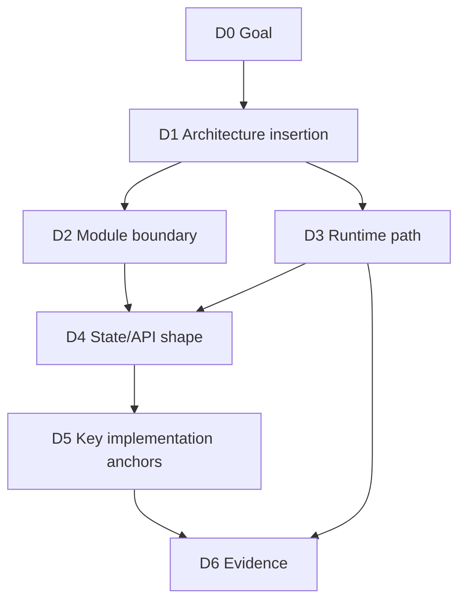
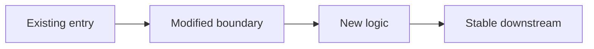
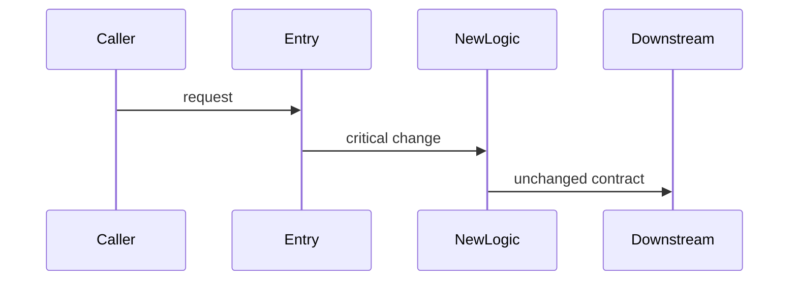

# TLDR Plan Output Template

# TLDR Plan

Feature: **...**
Source: [...]

## 0. Audit Dashboard

**Goal:** ...
**Top-level architecture decision:** ...
**Main behavior change:** ...
**Highest-risk decision:** ...
**Likely touched files/modules:** ...
**Must-not-change behavior:** ...
**User audit focus:** D1, D3, D5

## 1. Decision Map

| Decision | Chosen | Depends On | Audit |
|---|---|---|---|
| D1 | ... | D0 | [ ] ... |
| D2 | ... | D1 | [ ] ... |
| D3 | ... | D1, D2 | [ ] ... |

## 2. Critical Views

### 2.1 Architecture Integration View

**Architectural insertion point:** ...
**Downstream decisions unlocked:** ...

### 2.2 Runtime / Data Path View

**Before path:** ...
**After path:** ...
**Key invariant:** ...
**Important branches:** ...

## 3. Audit Checkpoints

- [ ] D1: ...
- [ ] D2: ...
- [ ] D3: ...
- [ ] D4: ...
- [ ] D5: ...
- [ ] D6: ...

## Appendix A: Full Decision Trace

| Decision | Layer | Chosen | Rejected | Depends On | Unlocks | User Audit |
|---|---|---|---|---|---|---|
| D0 | Goal | ... | ... | none | D1 | [ ] |
| D1 | Architecture | ... | ... | D0 | D2, D3 | [ ] |

## Appendix B: Full Module / File Boundary

| File / Module | Role | Allowed Change | Forbidden Responsibility | Parent Decision |
|---|---|---|---|---|
| `...` | ... | ... | ... | D2 |

## Appendix C: Full Risk -> Evidence Matrix

| Decision | Risk | Required Evidence | Stop Condition |
|---|---|---|---|
| D1 | ... | ... | ... |

## Appendix D: Implementation Detail Trace

| Implementation Detail | Parent Decision | Reason | Drift Risk |
|---|---|---|---|
| ... | D2, D3 | ... | medium |

## Appendix E: Execution Anchors

### Allowed Changes

- ...

### Forbidden Changes

- ...

### Stop Conditions

Stop and ask the user if:
- ...

### Done Criteria

- ...
